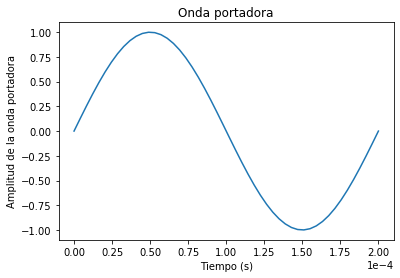
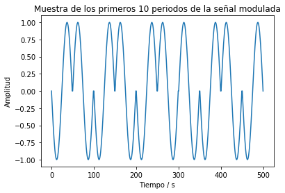
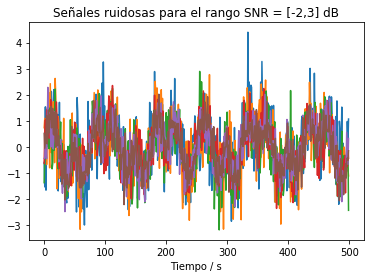
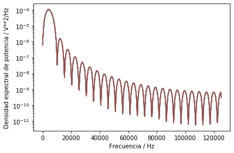
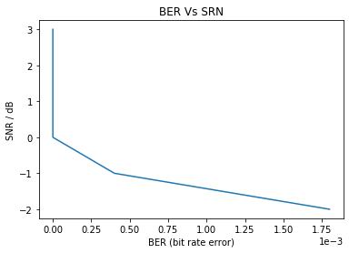

# MPSS - Tarea4: Procesos aleatorios
## Mariela Castillo Cabezas B61610

*1. Crear un esquema de modulación BPSK para los bits presentados. Esto implica asignar una forma de onda sinusoidal normalizada (amplitud unitaria) para cada bit y    luego una concatenación de todas estas formas de onda.

Inicialmente se realiza la lectura del archivo bits10k.csv proporcionado mediante la librería pandas, se establece una frecuencia de operación de 5000 Hz y 50 puntos de muestreo. Se genera la forma de la onda portadora de los bits y seguidamente se realiza la modulación BPSK, para ello se crea una variable llamada senal la cual servirá para almacenar datos de la señal modulada y se utiliza seno que corresponde a la forma de onda sinusoidal. Las gráficas generadas para mostrar la onda portadora y el comportamiento de los primeros 10 bits de la modulación se muestran a continuación: 

          

Con la gráfica de la señal modulada se observan los cambios que ocurren en la fase de la onda sinusoidal cuando ocurren cambios en la secuencia de los bits, por lo que se confirma una modulación BPSK correcta. 

*2. Calcular la potencia promedio de la señal modulada generada.

Para este punto fue necesario importar el paquete integrate de la librería scipy ya que la potencia promedio se obtiene integrando la potencia instántanea y diviendo este valor entre el número de bits por el período. A continuación se muestran las ecuaciones necesarias para el cálculo: 

<p align="center">
  
</p>

<p align="center">
  
</p>

<p align="center">
    
</p>

*3. Simular un canal ruidoso del tipo AWGN (ruido aditivo blanco gaussiano) con una relación señal a ruido (SNR) desde -2 hasta 3 dB.
Se creó un arreglo de numpy con los valores entre -2 dB y 3 dB el cual corresponde a los valores de SNR, además se crearon las señales ruidosas utilizando la función generadora de muestras aleatorias de numpy (numpy.random.normal), para esto último fue necesario determinar en primera instancia los valores de mu y sigma, mu se designó igual a cero y sigma se calculó como se muestra a continuación: 

    
    ```# Potencia del ruido (Pn) para SNR y potencia de la señal (Ps) dadas
    Pn = Ps / (10**(SNR / 10))
    
    # Desviación estándar del ruido
    sigma = np.sqrt(Pn)
    ```

Con esto fue posible generar los valores aleatorios que corresponden al ruido, estos valores se suman a la señal original para obtener el canal ruidoso. A continuación se muestra el gráfico de las señales ruidosas para el rango de [-2.3] dB.

 

*4. Graficar la densidad espectral de potencia de la señal con el método de Welch (SciPy), antes y después del canal ruidoso.

Para graficar la densidad espectral de potencia de la señal antes del canal ruidoso se utilizaron las siguientes líneas: 
    
    fw, PSD = signal.welch(senal, fm, nperseg=1024)
    plt.figure(3)
    plt.semilogy(fw, PSD)
    plt.xlabel('Frecuencia / Hz')
    plt.ylabel('Densidad espectral de potencia / V**2/Hz')
    
y para la densidad espectral de la señal después del canal ruidoso las siguientes: 

    fw, PSD = signal.welch(Rx, fm, nperseg=1024)
    plt.figure(4)
    plt.semilogy(fw, PSD)
    plt.xlabel('Frecuencia / Hz')
    plt.ylabel('Densidad espectral de potencia / V**2/Hz')
    
Con ello se generaron las siguientes figuras: 

         

En la gráfica correspondiente a la densidad espectral después del ruido se denota como la amplitud de esta varía dependiendo del valor de SNR, mientras que antes del ruido se tiene la misma densidad para cada uno de los seis valores. 

*5. Demodular y decodificar la señal y hacer un conteo de la tasa de error de bits (BER, bit error rate) para cada nivel SNR.

Para realizar la demodulación y decodificación de la señal se calculó la energía de la señal original y la energía de la señal con ruido. Se tiene que si la energía en la señal ruidosa es al menos la mitad de la energía de la señal original entonces se dice que en la señal original se tiene un valor igual a 1, para el caso contrario se dice que en la señal original se tiene un valor de 0. 

    # Pseudo-energía de la onda original 
    Es = np.sum(seno**2)
    
    # Inicialización del vector de bits recibidos
    bitsRx = np.zeros(bits.shape)
    
    for k, b in enumerate(bits):
        Ep = np.sum(Rx[k*p:(k+1)*p] * seno)
        if Ep > Es/2:
            bitsRx[k] = 1
        else:
            bitsRx[k] = 0
     
Seguidamente se calculó la tasa de error mediante las siguientes líneas: 

    err = np.sum(np.abs(bits - bitsRx))
    BER[i] = err/N
    
    print('Cuando SNR es igual a ', SNR, 'el ruido es ', BER[i])
   
Los resultados fueron: 

Cuando SNR = -2 el ruido es 0.0018001800180018
Cuando SNR = -1 el ruido es 0.00040004000400040005
Cuando SNR = 0 el ruido es 0.0
Cuando SNR = 1 el ruido es 0.0
Cuando SNR = 2 el ruido es 0.0
Cuando SNR = 3 el ruido es 0.0

Se observa una tasa de error con tendencia marcada hacia cero, disminuyendo conforme aumenta el valor de SNR. 

*6.Graficar BER versus SNR

Esta gráfica corresponde a BER versus SNR, para SNR entre -2 y 3 dB

 


