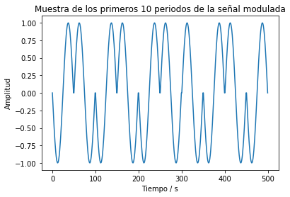

# MPSS - Tarea4: Procesos aleatorios
## Mariela Castillo Cabezas B61610

1. (20 %) Crear un esquema de modulación BPSK para los bits presentados. Esto implica asignar una forma de onda sinusoidal normalizada (amplitud unitaria) para cada bit y luego una concatenación de todas estas formas de onda.

Inicialmente se realiza la lectura del archivo bits10k.csv proporcionado mediante la librería pandas, se establece una frecuencia de operación de 5000 Hz y 50 puntos de muestreo y se genera la forma de la onda portadora de los bits. A continuación se presenta su gráfico: 

Seguidamente se debe realizar una modulación BPSK, para ello se crea una variable llamada senal la cual servirá para almacenar datos de la señal modulada y se utiliza seno que corresponde a la forma de onda sinusoidal. Para mostrar el comportamiento se graficaron los primeros 10 bits de la modulación: 

